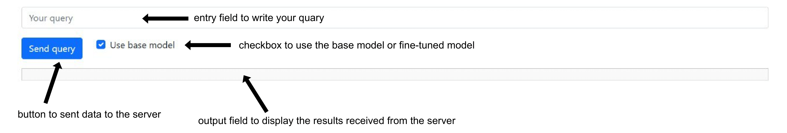

.. _lab_8_sft/README:

Laboratory work №8. Supervised Fine-Tuning (SFT) Large Language Models
======================================================================

.. toctree::
    :maxdepth: 1
    :titlesonly:
    :caption: Full API

    lab_8_sft.api.rst

Implementation tactics
----------------------

Stage 0. Start working with laboratory work
~~~~~~~~~~~~~~~~~~~~~~~~~~~~~~~~~~~~~~~~~~~

Start your implementation by selecting a new combination of model and dataset you are going
to use for **fine-tuning**. You can find all available combinations
in the `table <https://docs.google.com/spreadsheets/d/1PiNl1Y7jRtrFHjPY7dywOz0eTCp5VbAJVcCKShkGUcU/edit?usp=sharing>`__.

.. important:: For laboratory work №8, you need to select another task, namely, if
               there was a generation (Generation, Summarization, NMT) task,
               then you need to select classification (Detection, NLI) and vice versa.

.. important:: You have to open new Pull Request to implement Laboratory Work №8.

.. note:: All logic for instantiating and using needed abstractions
          should be implemented in a ``main()`` function of a ``start.py`` module.

To do this, implement the functions in the ``main.py`` module in ``lab_8_sft`` folder
and import them into ``start.py`` module in ``lab_8_sft`` folder.

.. code:: py

   if __name__ == '__main__':
       main()

.. note:: You need to set the desired mark: 4, 6, 8 or 10 in the ``target_score`` field
          in the ``settings.json`` file. The higher the desired mark, the more
          number of tests run when checking your Pull Request.

**Python competencies required to complete this tutorial:**
    * working with Transformers models;
    * working with HuggingFace datasets;
    * working with LoRA PEFT method;
    * estimating result using metric;
    * making server for the chosen task using FastAPI.

Motivation and purpose
----------------------

In this laboratory work, we will explore both inference and fine-tuning of Large Language
Models (LLMs), with a particular focus on **Supervised Fine-Tuning (SFT)** using
**Parameter-Efficient Fine-Tuning (PEFT)** techniques, specifically **LoRA (Low-Rank Adaptation)**.

As previously discussed, the lifecycle of LLMs consists of several phases, with two
key stages being:

    1. **Training** - the phase in which the model learns from a large labeled dataset,
       adjusting its internal parameters (weights and biases) to recognize patterns and
       relationships in the data. Training requires extensive computational resources and
       vast amounts of data.
    2. **Inference** - the phase in which the pre-trained model is used to generate predictions
       on new, unseen data without further modifications to its internal parameters. Inference
       is computationally less expensive and focuses on efficient, real-time responses.

However, in many real-world applications, pre-trained models do not always generalize well to
specific domains or tasks. To bridge this gap, fine-tuning is employed. Fine-tuning allows us
to adapt a general LLM to a specialized task by continuing its training on a smaller,
task-specific dataset.

Full fine-tuning of LLMs is computationally expensive, requiring access to large-scale
hardware resources. Parameter-Efficient Fine-Tuning (PEFT) methods, such as LoRA (Low-Rank Adaptation),
provide an alternative approach by modifying only a small subset of the model's parameters, making the
process more memory- and compute-efficient. LoRA achieves this by introducing low-rank adaptation
matrices to the model's pre-trained layers, significantly reducing the number of trainable parameters
while still maintaining high performance.

**The primary purpose** of this laboratory work is to:

    * Understand the difference between inference and fine-tuning in LLMs.
    * Learn how to fine-tune LLMs efficiently using LoRA within the PEFT framework.
    * Apply fine-tuned models to various NLP tasks such as Generation,
      Summarization, Classification, and Machine Translation.
    * Compare the performance of a pre-trained model versus a fine-tuned model on specific tasks.

By the end of this laboratory work, you will gain practical experience in applying
LoRA-based fine-tuning to adapt LLMs for specific tasks while optimizing for efficiency.

Stage 1. Infer one sample from dataset and demonstrate the result
~~~~~~~~~~~~~~~~~~~~~~~~~~~~~~~~~~~~~~~~~~~~~~~~~~~~~~~~~~~~~~~~~

.. important:: **Stages 1 - 4.3** from :ref:`lab_7_llm/README` are required to get the mark **4**.

Stage 2. Inference of model and demonstrate the result
~~~~~~~~~~~~~~~~~~~~~~~~~~~~~~~~~~~~~~~~~~~~~~~~~~~~~~

.. important:: **Stages 4.4 - 5.2** from :ref:`lab_7_llm/README` are required to get the mark **6**.

Stage 3. Tokenize one sample from dataset
"""""""""""""""""""""""""""""""""""""""""

Before fine-tuning a model, it is important to properly prepare the data.
Since the data is presented as text, it must be tokenized (i.e.
converted into a numeric representation) to prepare it for transfer
to the model for fine-tuning.

Implement :py:func:`lab_8_sft.main.tokenize_sample` function, which tokenizes the
sample and truncates it to its maximum length.

Set the following parameters for tokenizer:

    * ``padding="max_length"``;
    * ``truncation=True``;
    * ``max_length=120``.

Method should return a dictionary with the ``input_ids``, ``attention_mask`` and
``labels`` for current sample as keys. Such return values provide the necessary
information to feed into the model, ensuring the correct fine-tuning process.

.. important:: It is necessary to have such keys (``input_ids``,
               ``attention_mask`` and ``labels``) of the returned dictionary, since
               the ``transformers`` library has built-in data processing mechanisms
               that expect exactly these names.

.. important:: For Seq2Seq models, it is necessary to tokenize not only
               sample from the source column, but also from the target column.

Stage 4. Introduce dataset abstraction: ``TokenizedTaskDataset``
~~~~~~~~~~~~~~~~~~~~~~~~~~~~~~~~~~~~~~~~~~~~~~~~~~~~~~~~~~~~~~~~

As in the previous laboratory work to interact with the model we will use PyTorch
`Dataset <https://pytorch.org/docs/stable/data.html#torch.utils.data.Dataset>`__ abstraction.
We convert ``pd.DataFrame`` to ``Dataset`` and override some methods, because in the next step
we will use Transformers ``Trainer`` abstraction, which uses PyTorch ``DataLoader`` internally
to efficiently load the data into the model's memory,
process it in batches and pass it to the model.

Implement :py:class:`lab_8_sft.main.TokenizedTaskDataset` abstraction, which allows to
prepare data for fine-tuning.

This class inherits from ``torch.utils.data.Dataset`` abstraction,
which has one internal attribute:

    * ``self._data`` - ``pd.DataFrame`` with preprocessed data.

Fill the attribute ``self._data`` with tokenized samples from the data.
Use the function :py:func:`lab_8_sft.main.tokenize_sample`.

So, this class allows to combine ``pd.DataFrame`` and PyTorch ``Dataset``,
tokenize text in the required format for the model,
ensure efficient data loading during fine-tuning and allows ``Trainer`` to load data in
batches for tuning.

.. important:: When instantiating ``TokenizedTaskDataset``
               abstraction in ``start.py`` module,
               limit the full ``pd.DataFrame`` you got
               from ``RawDataPreprocessor`` to the number of samples, calculating it for
               training using the batch and the number of training steps. Take the next
               samples after the ones you used for inference, namely starting with
               sample ``10``.

See the intended instantiation:

.. code:: py

    num_samples = 100
    fine_tune_samples = batch * fine_tuning_steps
    dataset = TokenizedTaskDataset(preprocessor.data.loc[
            num_samples : num_samples + fine_tune_samples
        ])

where ``preprocessor.data`` is the property of the ``RawDataPreprocessor`` class.

Stage 4.1. Get the dataset length
"""""""""""""""""""""""""""""""""

In the next two steps, we will override some methods
that will allow us to further tune the model.

Implement :py:meth:`lab_8_sft.main.TokenizedTaskDataset.__len__` method
which allows to get the number of items in dataset.
PyTorch ``DataLoader`` uses this method
to determine the total number of batches.

Stage 4.2. Retrieve an item from the dataset
""""""""""""""""""""""""""""""""""""""""""""

Implement :py:meth:`lab_8_sft.main.TokenizedTaskDataset.__getitem__` method
which allows to retrieve an item from the dataset by index.

PyTorch ``DataLoader`` calls this method to retrieve data for each batch.
Implementing this method allows you to define how the data is retrieved
from the dataset and how it is structured.
It should return a dictionary that contains the result of tokenizing
one sample from the dataset by index.

.. note:: For example, if the data at index 0 contains the sample
          ``i feel bitchy but not defeated yet``, then
          :py:meth:`lab_8_sft.main.TokenizedTaskDataset.__getitem__`
          method will output the following value: ``{'input_ids': tensor([...]),
          'attention_mask': tensor([...]), 'labels': 3}``

Stage 5. Introduce SFT Pipeline: ``SFTPipeline``
~~~~~~~~~~~~~~~~~~~~~~~~~~~~~~~~~~~~~~~~~~~~~~~~

To fine-tune the selected model, you need to implement the
:py:class:`lab_8_sft.main.SFTPipeline` abstraction.

This class inherits from
:py:class:`core_utils.llm.sft_pipeline.AbstractSFTPipeline`,
which provides a structure for initializing a model and performing fine-tuning.

The class has the following internal attributes:

    * ``self._lora_config`` – configuration for LoRA;
    * ``self._model`` – a pre-trained model.

.. note:: When configuring ``LoRAConfig``, set the following parameters:
          ``r=8``, ``lora_alpha=8``, ``lora_dropout=0.1`` and ``target_module`` from SFT parameters.

See the intended instantiation:

.. code:: py

    pipeline = SFTPipeline(settings.parameters.model, dataset, sft_params)

where:

    * ``settings.parameters.model`` is the name of the pre-trained model;
    * ``dataset`` is an instance of ``TaskDataset`` abstraction;
    * ``sft_params`` contains the fine-tuning parameters.

Stage 5.1. Model fine-tuning
~~~~~~~~~~~~~~~~~~~~~~~~~~~~

Implement method
:py:meth:`lab_8_sft.main.SFTPipeline.run`,
which allows to fine-tune a pre-trained model using the LoRA method.

Before starting fine-tuning, set up the training parameters using the
`TrainingArguments <https://huggingface.co/docs/transformers/main_classes/trainer#transformers.TrainingArguments>`__.
Define parameters such as ``max_steps``, ``per_device_train_batch_size``, ``learning_rate``,
``save_strategy``, ``use_cpu``, ``load_best_model_at_end`` to control the training and
optimization process.

To train the model, use `Trainer <https://huggingface.co/docs/transformers/main_classes/trainer>`__,
which takes the model, training arguments, and dataset as input.

.. note::

    - Initialize the model with LoRA adapters using ``get_peft_model()``
      from `PEFT <https://huggingface.co/docs/peft/index#peft>`__.

    - ``peft`` module version 0.17.1 needs to be installed.

.. important:: After fine-tuning process merge LoRA-adapted weights and then
               save the fine-tuned model to the specified output directory, the path to which
               you can get from :py:class:`core_utils.llm.sft_pipeline.AbstractSFTPipeline`
               class.

Stage 5.2. Demonstrate the result in ``start.py``
"""""""""""""""""""""""""""""""""""""""""""""""""

.. important:: **Stages 3 - 5.2** are required to get the mark **8**.

Demonstrate fine-tuning process and fine-tuned model performance evaluation
in the ``main()`` function of the ``start.py`` module.

So, the pipeline should include the following stages:

    1. preparation of the dataset for fine-tuning;
    2. fine-tuning of the model;
    3. analysis of the fine-tuned model;
    4. inference of the fine-tuned model;
    5. evaluation of the quality of the fine-tuned model.

Set the following parameters:

   * **Inference parameters**: ``num_samples=100``, ``max_length=120`` and ``batch_size=64``.
   * **SFT parameters**: ``batch_size=3``, ``max_length=120``, ``max_fine_tuning_steps=50``
     and ``learning_rate=1e-3``.

.. important:: You can find all needed specific values for parameters for your
               combination of model and dataset choosing appropriate task:

                   * :ref:`classification-label`
                   * :ref:`generation-label`
                   * :ref:`nli-label`
                   * :ref:`nmt-label`
                   * :ref:`summarization-label`

.. important:: To infer the fine-tuned model you need to save it to
               :py:attr:`core_utils.project.lab_settings.SFTParams.finetuned_model_path`

.. note:: After model inference you have to save
          you predictions to ``dist/predictions.csv`` file in ``start.py``.

Stage 6. Implement model as a service and demonstrate the result
""""""""""""""""""""""""""""""""""""""""""""""""""""""""""""""""

.. important:: **Stages 6** from :ref:`lab_7_llm/README` are required to get the mark **10**.

An example of start page might look like this:

.. important:: You need to add a checkbox that is responsible
               for which model's result will be output as an answer. If the
               ``Use base model`` option is enabled, use a
               pretrained model, otherwise use a fine-tuned one.
